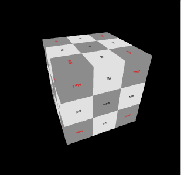
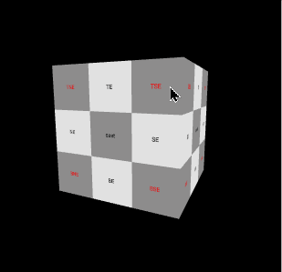
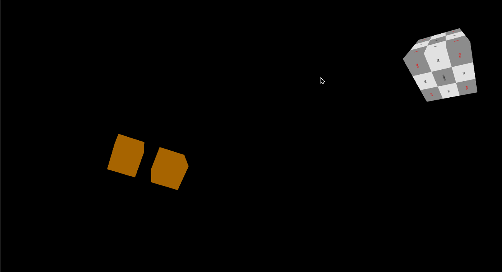

# ControlViewCube



## Description

ControlViewCube brings Modern CAD's View Cube feature to 3js

### Features

1. **Interactive 3D Cube:** A visually engaging cube that responds to camera controls for interactive exploration.

2. **Smooth Navigation:** Intuitive camera navigation facilitated by mouse and keyboard inputs, providing a seamless user experience.

3. **React Integration:** Built with React, ensuring a modular and component-based structure for ease of development and maintenance.

4. **@react-three/drei Integration:** Utilizes the @react-three/drei library to simplify the integration of Three.js components, streamlining the development process.

5. **Minimal Setup:** Requires minimal setup and configuration, allowing developers to quickly integrate the camera control cube into their projects.

6. **Easy Customization:** Highly customizable and extendable, providing flexibility for developers to adapt the cube to their specific needs.

7. **Responsive Design:** Designed with responsiveness in mind, ensuring a smooth experience across various devices, including mobile devices.

Feel free to adjust the wording or structure to better match your preferred style. This format aims to make each feature stand out and be easily digestible for users.

### Animation 



### Screenshot




## Future Implementations / Roadmap

The Camera Control Cube project is a work in progress, and the following features and improvements are planned for future releases:

1. **Touch Controls:** Integrate touch controls for mobile devices to enhance the project's accessibility.

2. **Advanced Camera Modes:** Implement additional camera modes, such as orbit, fly, and first-person, to provide users with more diverse navigation options.

3. **Custom Themes:** Allow users to easily customize the appearance of the ControlViewCube, including color schemes and styling options.

4. **Animation Support:** Introduce support for animations, enabling developers to incorporate dynamic 3D effects within the ControlViewCube.

5. **Performance Optimization:** Conduct performance optimizations to ensure smooth rendering and responsiveness, especially for complex scenes.

6. **API Enhancements:** Expand the API to offer more configuration options, making it even more versatile for different use cases.

7. **Community Contributions:** Encourage and welcome contributions from the community to enhance and expand the project's capabilities.

8. **Documentation Enhancements:** Continuously improve documentation to provide comprehensive guidance on usage, configuration, and customization.

Please note that this roadmap is subject to change, and new features may be added or reprioritized based on user feedback and project evolution. Contributions from the open-source community are highly valued and appreciated.

We look forward to making Camera Control Cube even more feature-rich and user-friendly in future updates!

## Installation


```
npm init 

npm install three @react-three/fiber @react-three/drei

npm install @kuraykaraaslan/control-view-cube
```


## One Line Inject
just put
```
import { ControlViewCube } from '@kuraykaraaslan/control-view-cube';
```
and

```
<Canvas>
<OrbitControls> !OrbitControls has to be in the canvas!
<ControlViewCube />
<Canvas />
```
in canvas and go.

Project Structure
The project structure is designed to keep the code organized and easy to understand. Here's an overview of the main files and directories:

cube.js: The main React component that renders the 3D cube and sets up camera controls.
index.js: Entry point of the application.

### Dependencies
React: A JavaScript library for building user interfaces.
@react-three/drei: A library of useful helpers and abstractions for building with Three.js and React.
Three.js: A JavaScript 3D library that makes it easy to create and display 3D graphics in the browser.

### Contributing
Contributions are welcome! If you'd like to contribute to this project, feel free to fork the repository, make your changes, and submit a pull request.

### License
This project is licensed under the MIT License - see the LICENSE file for details.
Note: This is a basic README template to get you started. Feel free to customize it according to your project's specific details and requirements.

## Props

| Name             | Type     | Description |
|------------------|----------|-------------|
| **style**        | Object   | Styling properties for the `ControlViewCube` component. |
| style.position   | String   | Specifies the positioning of the component (`'absolute'`). |
| style.top        | String   | Positions the component at the top-right corner of its container. |
| style.right      | String   | Positions the component at the top-right corner of its container. |
| style.width      | String   | Sets the width of the component to 200px. |
| style.height     | String   | Sets the height of the component to 200px. |
| style.zIndex     | String   | Specifies the stacking order of the component (z-index of 1000). |
| style.backgroundColor | String | Sets the background color of the component to `'transparent'`. |
| style.texts      | Object   | Configures the display of text on the control cube. |
| style.colors     | Object   | Defines color schemes for main, edge, and corner elements. |
| **locale**       | Object   | Contains localization strings for different directions and positions on the cube. |
| **settings**     | Object   | Specifies various settings for the `ControlViewCube` component. |
| settings.centerNodes | Boolean | Indicates whether to display nodes at the center. |
| settings.cornerNodes | Boolean | Indicates whether to display nodes at the corners. |
| settings.edgeNodes | Boolean  | Indicates whether to display nodes at the edges. |
| settings.syncCamera | Boolean | Indicates whether to synchronize the camera with the control cube. |
| settings.syncFrequency | Number | Sets the synchronization frequency to 100 (milliseconds). |
| settings.syncMode | Number   | Specifies the synchronization mode (0 for always focus, 1 for free rotation). |


